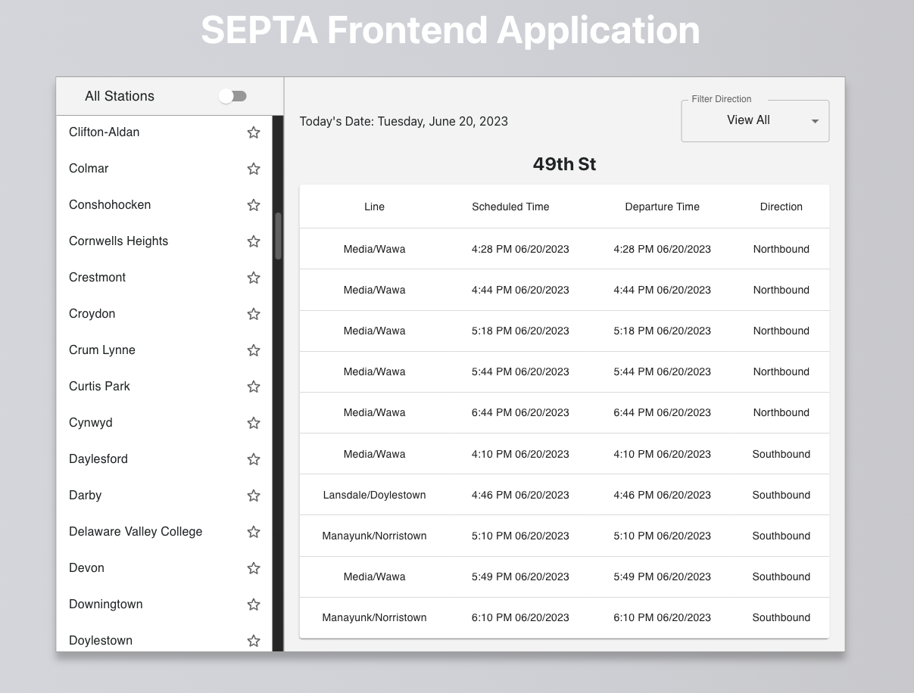

# SEPTA Frontend

> SEPTA Frontend App is a front-end web application to manage the list of favorite stations.

Check out the app deployed on github pages here --> [SEPTA-frontend-app](https://pa-dg.github.io/SEPTA-frontend-app/)

## MVP Features:

### View list of All Stations

- User is able to view list of all stations (from the stations.json file within the project directory)

### Favorite a Station

- User can favorite/unfavorite a station by toggling 'star' icon button. This information is persisted into the browser using web storage API (Localstorage)

### Filter between list of favorite stations and all stations

- User can toggle between a list of favorite stations and all stations

### Display Station Information

- User can select a station from the list of stations and upon selection, station information is displayed including train line, schedule time, depart time, and direction

### Filter by Direction

- User can filter the displayed station information by direction (Northbound, Southbound, All)

## Technologies/Libraries used for this project include:

- JavaScript (ES6+)
- HTML5
- CSS3 (Sass)
- React
- TypeScript
- Material-UI
- [Vite](https://vitejs.dev/)
- Localstorage
- SEPTA API: `https://www3.septa.org/api/Arrivals/index.php?station={STATION_NAME}&direction={DIRECTION=N or S}`

## Setup

To set up and run locally:

1. Clone this Github repository:

```bash
  git clone https://github.com/pa-dg/SEPTA-frontend-app.git
```

2. Change directory onto the project folder and install frontend dependencies:

```bash
  cd ./septa-frontend
  npm install
```

3. Start development server:

```bash
  npm run dev
```

4. Opn your browser tab to `http://localhost:5173/`.


